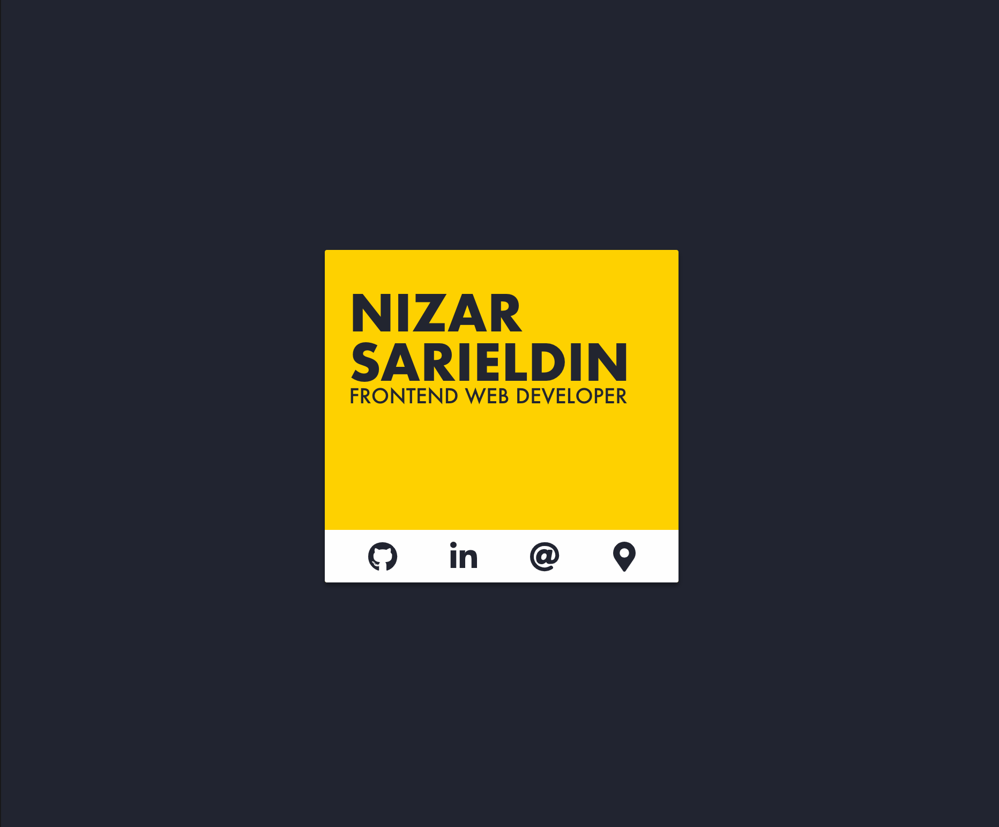

#### Web Page
``` 
    www.nizar-sarieldin.com
```

# Portfolio Website
This project with [Create React App](https://github.com/facebook/create-react-app)

### Clone Project:
```
    git clone "https://github.com/NzrSrd/profile.git"
```

### Installation:
```
    npm install
```

## Available Scripts

In the project directory, you can run:

```
    npm start
```

Runs the app in the development mode.<br>
Open [http://localhost:3000](http://localhost:3000) to view it in the browser.

The page will reload if you make edits.<br>
You will also see any lint errors in the console.